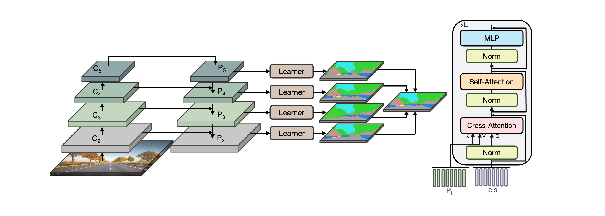

[](https://paperswithcode.com/sota/semantic-segmentation-on-coco-stuff-test?p=efficient-self-ensemble-framework-for-1)

[](https://paperswithcode.com/sota/semantic-segmentation-on-pascal-context?p=efficient-self-ensemble-framework-for-1)

[](https://paperswithcode.com/sota/semantic-segmentation-on-ade20k-val?p=efficient-self-ensemble-framework-for-1)
# SenFormer: Efficient Self-Ensemble Framework for Semantic Segmentation

[Efficient Self-Ensemble Framework for Semantic Segmentation](https://arxiv.org/abs/2111.13280)
by Walid Bousselham, Guillaume Thibault, Lucas Pagano, Archana Machireddy, Joe Gray, Young Hwan Chang and Xubo Song.

This repository contains the official Pytorch implementation of training & evaluation code and the pretrained models for SenFormer.
<div align="center">
  
</div>
<br />

<a href="mmseg/models/decode_heads/senformer.py#L192">:floppy_disk:Code Snippet _(SenFormer)_</a>| 
<a href="mmseg/models/necks/fpnt.py#L45"> :keyboard: Code Snippet _(FPNT)_</a>|
<a href="https://arxiv.org/abs/2111.13280"> :scroll: Paper</a> | 
<a href="https://tongtianta.site/paper/100450">论文</a> |
<a href="https://youtu.be/K83b5WRJ3tM"> : movie_camera: video</a>
# :hammer: Installation
### Conda environment
- Clone this repository and enter it: ` git clone git@github.com:WalBouss/SenFormer.git && cd SenFormer`.
- Create a conda environment  `conda create -n senformer python=3.8`, and activate it `conda activate senformer`.
- Install Pytorch and torchvision `conda install pytorch==1.7.1 torchvision==0.8.2 cudatoolkit=10.2 -c pytorch` — (you may also switch to other version by specifying the version number).
- Install MMCV library `pip install mmcv-full==1.4.0`
- Install MMSegmentation library by running `pip install -e .` in SenFormer directory.
- Install other requirements `pip install timm einops`

Here is a full script for setting up a conda environment to use SenFormer (with `CUDA 10.2` and `pytorch 1.7.1`):
```sh
conda create -n senformer python=3.8
conda activate senformer
conda install pytorch==1.7.1 torchvision==0.8.2 cudatoolkit=10.2 -c pytorch

git clone git@github.com:WalBouss/SenFormer.git && cd SenFormer
pip install mmcv-full==1.4.0
pip install -e .
pip install timm einops
```
### Datasets
For datasets preparations please refer to [MMSegmentation guidelines](https://mmsegmentation.readthedocs.io/en/latest/dataset_prepare.html).
### Pretrained weights
ResNet pretrained weights will be automatically downloaded before training.

For Swin Transformer ImageNet pretrained weights, you can either:
- run `bash tools/download_swin_weights.sh` in SenFormer project to download all Swin Transformer pretrained weights _(it will place weights under `pretrain/` folder )_.
- download desired backbone weights here: [`Swin-T`](https://archive.org/download/senformer_weights/swin_tiny_patch4_window7_224.pth),
[`Swin-S`](https://archive.org/download/senformer_weights/swin_small_patch4_window7_224.pth),
[`Swin-B`](https://archive.org/download/senformer_weights/swin_base_patch4_window12_384_22k.pth),
[`Swin-L`](https://archive.org/download/senformer_weights/swin_large_patch4_window12_384_22k.pth) and place them under `pretrain/` folder.
- download weights from [official repository](https://github.com/microsoft/Swin-Transformer) then, convert them to mmsegmentation format following [mmsegmentation guidelines](https://mmsegmentation.readthedocs.io/en/latest/useful_tools.html#vit-swin-mit-transformer-models).
# :dart: Model Zoo
SenFormer models with ResNet and Swin's backbones and ADE20K, COCO-Stuff 10K, Pascal Context and Cityscapes.
### ADE20K
<table>
  <tr>
    <th>Backbone</th>
    <th>weight sharing</th>
    <th>mIoU </th>
    <th>mIoU (MS)</th>
    <th>#params</th>
    <th>FLOPs</th>
    <th>Resolution</th>
    <th colspan="2">Download</th>
  </tr>
<tr>
    <td rowspan="2">ResNet-50</td>
    <td style="text-align:center"> :white_check_mark: </td>
    <td>44.38</td>
    <td>45.2</td>
    <td style="font-weight: bold;">55M</td>
    <td rowspan="2" >179G</td>
    <td rowspan="2" >512x512 </td>
    <td><a href="https://archive.org/download/senformer_weights/senformer_r50_512x512_ade20k.pth">model</a></td>
    <td><a href="senformer_configs/senformer/ade20k/senformer_fpnt_r50_512x512_160k_ade20k.py">config</a></td>
  </tr>
<tr>
    <td style="text-align:center"> :x: </td>
    <td>44.6</td>
    <td>45.6</td>
    <td>144M</td>
    <td><a href="https://archive.org/download/senformer_weights/senformerNWS_r50_512x512_ade20k.pth">model</a></td>
    <td><a href="senformer_configs/senformer/ade20k/senformerNWS_fpnt_r50_512x512_160k_ade20k.py">config</a></td>
</tr>
<tr>
    <td rowspan="2">ResNet-101</td>
    <td style="text-align:center"> :white_check_mark: </td>
    <td>46.93</td>
    <td>47.9</td>
    <td style="font-weight: bold;">79M</td>
    <td rowspan="2">199G</td>
    <td rowspan="2">512x512</td>
    <td><a href="https://archive.org/download/senformer_weights/senformer_r101_512x512_ade20k.pth">model</a></td>
    <td><a href="senformer_configs/senformer/ade20k/senformer_fpnt_r101_512x512_160k_ade20k.py">config</a></td>
  </tr>
<tr>
    <td style="text-align:center"> :x: </td>
    <td>46.5</td>
    <td>47.0</td>
    <td>163M</td>
    <td><a href="https://archive.org/download/senformer_weights/senformerNWS_r101_512x512_ade20k.pth">model</a></td>
    <td><a href="senformer_configs/senformer/ade20k/senformerNWS_fpnt_r101_512x512_160k_ade20k.py">config</a></td>
  </tr>
<tr>
    <td rowspan="2">Swin-Tiny</td>
    <td style="text-align:center">  :white_check_mark: </td>
    <td>46.0</td>
    <td> - </td>
    <td style="font-weight: bold;">59M</td>
    <td rowspan="2">179G</td>
    <td rowspan="2">512x512</td>
    <td><a href="https://archive.org/download/senformer_weights/senformer_swin_tiny_512x512_ade20k.pth">model</a></td>
    <td><a href="senformer_configs/senformer/ade20k/senformer_fpnt_swin_tiny_512x512_160k_ade20k.py">config</a></td>
  </tr>
<tr>
    <td style="text-align:center"> :x: </td>
    <td>46.0</td>
    <td>46.4</td>
    <td>144M</td>
    <td><a href="https://archive.org/download/senformer_weights/senformerNWS_swin_tiny_512x512_ade20k.pth">model</a></td>
    <td><a href="senformer_configs/senformer/ade20k/senformerNWS_fpnt_swin_tiny_512x512_160k_ade20k.py">config</a></td>
</tr>
<tr>
    <td rowspan="2">Swin-Small</td>
    <td style="text-align:center"> :white_check_mark: </td>
    <td>49.2</td>
    <td> - </td>
    <td style="font-weight: bold;">81M</td>
    <td rowspan="2">202G</td>
    <td rowspan="2">512x512</td>
    <td><a href="https://archive.org/download/senformer_weights/senformer_swin_small_512x512_ade20k.pth">model</a></td>
    <td><a href="senformer_configs/senformer/ade20k/senformer_fpnt_swin_small_512x512_160k_ade20k.py">config</a></td>
  </tr>
<tr>
    <td style="text-align:center"> :x: </td>
    <td>49.2</td>
    <td>50.4</td>
    <td>165M</td>
    <td><a href="https://archive.org/download/senformer_weights/senformerNWS_swin_small_512x512_ade20k.pth">model</a></td>
    <td><a href="senformer_configs/senformer/ade20k/senformerNWS_fpnt_swin_small_512x512_160k_ade20k.py">config</a></td>
</tr>
<tr>
    <td rowspan="2">Swin-Base</td>
    <td style="text-align:center"> :white_check_mark: </td>
    <td>52.2</td>
    <td> - </td>
    <td style="font-weight: bold;">120M</td>
    <td rowspan="2">242G</td>
    <td rowspan="2">640x640</td>
    <td><a href="https://archive.org/download/senformer_weights/senformer_swin_base_640x640_ade20k.pth">model</a></td>
    <td><a href="senformer_configs/senformer/ade20k/senformer_fpnt_swin_base_640x640_160k_ade20k.py">config</a></td>
  </tr>
<tr>
    <td style="text-align:center"> :x: </td>
    <td>51.8</td>
    <td>53.2</td>
    <td>204M</td>
    <td><a href="https://archive.org/download/senformer_weights/senformerNWS_swin_base_640x640_ade20k.pth">model</a></td>
    <td><a href="senformer_configs/senformer/ade20k/senformerNWS_fpnt_swin_base_640x640_160k_ade20k.py">config</a></td>
</tr>
<tr>
    <td rowspan="2">Swin-Large</td>
    <td style="text-align:center"> :white_check_mark: </td>
    <td>53.1</td>
    <td> - </td>
    <td style="font-weight: bold;"> 233M </td>
    <td rowspan="2">546G</td>
    <td rowspan="2">640x640</td>
    <td><a href="https://archive.org/download/senformer_weights/senformer_swin_large_640x640_ade20k.pth">model</a></td>
    <td><a href="senformer_configs/senformer/ade20k/senformer_fpnt_swin_large_640x640_160k_ade20k.py">config</a></td>
  </tr>
<tr>
    <td style="text-align:center"> :x: </td>
    <td>53.1</td>
    <td>54.2</td>
    <td>314M</td>
    <td><a href="https://archive.org/download/senformer_weights/senformerNWS_swin_large_640x640_ade20k.pth">model</a></td>
    <td><a href="senformer_configs/senformer/ade20k/senformerNWS_fpnt_swin_large_640x640_160k_ade20k.py">config</a></td>
</tr>
</table>

### COCO-Stuff 10K
<table>
  <tr>
    <th>Backbone</th>
    <th>weight sharing</th>
    <th>mIoU </th>
    <th>mIoU (MS)</th>
    <th>#params</th>
    <th>Resolution</th>
    <th colspan="2">Download</th>
  </tr>
<tr>
    <td rowspan="2">ResNet-50</td>
    <td style="text-align:center"> :white_check_mark: </td>
    <td>40.0</td>
    <td>41.3</td>
    <td style="font-weight: bold;">55M</td>
    <td rowspan="2">512x512</td>
    <td><a href="https://archive.org/download/senformer_weights/senformer_r50_512x512_coco.pth">model</a></td>
    <td><a href="senformer_configs/senformer/coco-stuff10k/senformer_fpnt_r50_512x512_80k_coco.py">config</a></td>
  </tr>
<tr>
<td style="text-align:center"> :x: </td>
    <td>39.0</td>
    <td>39.7</td>
    <td>144M</td>
    <td><a href="https://archive.org/download/senformer_weights/senformerNWS_r50_512x512_coco.pth">model</a></td>
    <td><a href="senformer_configs/senformer/coco-stuff10k/senformerNWS_fpnt_r50_512x512_80k_coco.py">config</a></td>
</tr>
<tr>
    <td rowspan="2">ResNet-101</td>
    <td style="text-align:center"> :white_check_mark: </td>
    <td>41.0 </td>
    <td>42.1</td>
    <td style="font-weight: bold;">79M</td>
    <td rowspan="2">512x512</td>
    <td><a href="https://archive.org/download/senformer_weights/senformer_r101_512x512_coco.pth">model</a></td>
    <td><a href="senformer_configs/senformer/coco-stuff10k/senformer_fpnt_r101_512x512_80k_coco.py">config</a></td>
  </tr>
<tr>
<td style="text-align:center"> :x: </td>
    <td>39.6</td>
    <td>40.6</td>
    <td>163M</td>
    <td><a href="https://archive.org/download/senformer_weights/senformerNWS_r101_512x512_coco.pth">model</a></td>
    <td><a href="senformer_configs/senformer/coco-stuff10k/senformerNWS_fpnt_r101_512x512_80k_coco.py">config</a></td>
</tr>
<tr>
    <td rowspan="2">Swin-Large</td>
    <td style="text-align:center"> :white_check_mark: </td>
    <td>49.8 </td>
    <td>51.5</td>
    <td style="font-weight: bold;"> 233M </td>
    <td rowspan="2">512x512</td>
    <td><a href="https://archive.org/download/senformer_weights/senformer_swin_large_512x512_coco.pth">model</a></td>
    <td><a href="senformer_configs/senformer/coco-stuff10k/senformer_fpnt_swin_large_512x512_80k_coco.py">config</a></td>
  </tr>
<tr>
    <td style="text-align:center"> :x: </td>
    <td>49.1</td>
    <td>50.1</td>
    <td>314M</td>
    <td><a href="https://archive.org/download/senformer_weights/senformerNWS_swin_large_512x512_coco.pth">model</a></td>
    <td><a href="senformer_configs/senformer/coco-stuff10k/senformerNWS_fpnt_swin_large_512x512_80k_coco.py">config</a></td>
</tr>
</table>

### Pascal Context
<table>
  <tr>
    <th>Backbone</th>
    <th>weigth sharing</th>
    <th>mIoU </th>
    <th>mIoU (MS)</th>
    <th>#params</th>
    <th>Resolution</th>
    <th colspan="2">Download</th>
  </tr>
<tr>
    <td rowspan="2">ResNet-50</td>
    <td style="text-align:center"> :white_check_mark: </td>
    <td>53.2 </td>
    <td>54.3</td>
    <td style="font-weight: bold;">55M</td>
    <td rowspan="2">480x480</td>
    <td><a href="https://archive.org/download/senformer_weights/senformer_r50_480x480_pascal.pth">model</a></td>
    <td><a href="senformer_configs/senformer/pascal/senformer_fpnt_r50_480x480_40k_pascal.py">config</a></td>
  </tr>
<tr>
    <td style="text-align:center"> :x: </td>
    <td>53.2</td>
    <td>54.3</td>
    <td>144M</td>
    <td><a href="https://archive.org/download/senformer_weights/senformerNWS_r50_480x480_pascal.pth">model</a></td>
    <td><a href="senformer_configs/senformer/pascal/senformerNWS_fpnt_r50_480x480_40k_pascal.py">config</a></td>
  </tr>
<tr>
    <td rowspan="2">ResNet-101</td>
    <td style="text-align:center"> :white_check_mark: </td>
    <td>54.6</td>
    <td>56.6</td>
    <td style="font-weight: bold;">79M</td>
    <td rowspan="2">480x480</td>
    <td><a href="https://archive.org/download/senformer_weights/senformer_r101_480x480_pascal.pth">model</a></td>
    <td><a href="senformer_configs/senformer/pascal/senformer_fpnt_r101_480x480_40k_pascal.py">config</a></td>
  </tr>
<tr>
    <td style="text-align:center"> :x:</td>
    <td>55.1</td>
    <td>56.6</td>
    <td>163M</td>
    <td><a href="https://archive.org/download/senformer_weights/senformerNWS_r101_480x480_pascal.pth">model</a></td>
    <td><a href="senformer_configs/senformer/pascal/senformerNWS_fpnt_r101_480x480_40k_pascal.py">config</a></td>
  </tr>
<tr>
    <td rowspan="2">Swin-Large</td>
    <td style="text-align:center"> :white_check_mark: </td>
    <td>63.1</td>
    <td>64.5</td>
    <td style="font-weight: bold;"> 233M </td>
    <td rowspan="2">480x480</td>
    <td><a href="https://archive.org/download/senformer_weights/senformer_swin_large_480x480_pascal.pth">model</a></td>
    <td><a href="senformer_configs/senformer/pascal/senformer_fpnt_swin_large_480x480_40k_pascal.py">config</a></td>
  </tr>
<tr>
    <td style="text-align:center"> :x: </td>
    <td>62.4</td>
    <td>64.0</td>
    <td>314M</td>
    <td><a href="https://archive.org/download/senformer_weights/senformerNWS_swin_large_480x480_pascal.pth">model</a></td>
    <td><a href="senformer_configs/senformer/pascal/senformerNWS_fpnt_swin_large_480x480_40k_pascal.py">config</a></td>
  </tr>
</table>

### Cityscapes
<table>
  <tr>
    <th>Backbone</th>
    <th>weight sharing</th>
    <th>mIoU </th>
    <th>mIoU (MS)</th>
    <th>#params</th>
    <th>Resolution</th>
    <th colspan="2">Download</th>
  </tr>
<tr>
    <td rowspan="2">ResNet-50</td>
    <td style="text-align:center"> :white_check_mark: </td>
    <td>78.8</td>
    <td>80.1</td>
    <td style="font-weight: bold;">55M</td>
    <td rowspan="2">512x1024</td>
    <td><a href="https://archive.org/download/senformer_weights/senformer_r50_512x1024_cityscapes.pth">model</a></td>
    <td><a href="senformer_configs/senformer/cityscapes/senformer_fpnt_r50_512x1024_100k_cityscapes.py">config</a></td>
  </tr>
<tr>
    <td style="text-align:center"> :x: </td>
    <td>78.8</td>
    <td>80.1</td>
    <td>144M</td>
    <td><a href="https://archive.org/download/senformer_weights/senformerNWS_r50_512x1024_cityscapes.pth">model</a></td>
    <td><a href="senformer_configs/senformer/cityscapes/senformerNWS_fpnt_r50_512x1024_100k_cityscapes.py">config</a></td>
  </tr>
<tr>
    <td rowspan="2">ResNet-101</td>
    <td style="text-align:center"> :white_check_mark: </td>
    <td>79.9</td>
    <td>81.4</td>
    <td style="font-weight: bold;">79M</td>
    <td rowspan="2">512x1024</td>
    <td><a href="https://archive.org/download/senformer_weights/senformer_r101_512x1024_cityscapes.pth">model</a></td>
    <td><a href="senformer_configs/senformer/cityscapes/senformer_fpnt_r101_512x1024_100k_cityscapes.py">config</a></td>
  </tr>
<tr>
    <td style="text-align:center"> :x: </td>
    <td>80.3</td>
    <td>81.4</td>
    <td>163M</td>
    <td><a href="https://archive.org/download/senformer_weights/senformerNWS_r101_512x1024_cityscapes.pth">model</a></td>
    <td><a href="senformer_configs/senformer/cityscapes/senformerNWS_fpnt_r101_512x1024_100k_cityscapes.py">config</a></td>
  </tr>
<tr>
    <td rowspan="2">Swin-Large</td>
    <td style="text-align:center"> :white_check_mark: </td>
    <td>82.8</td>
    <td>84.0</td>
    <td style="font-weight: bold;"> 233M </td>
    <td rowspan="2">512x1024</td>
    <td><a href="https://archive.org/download/senformer_weights/senformer_swin_large_512x1024_cityscapes.pth">model</a></td>
    <td><a href="senformer_configs/senformer/cityscapes/senformer_fpnt_swin_large_512x1024_100k_cityscapes.py">config</a></td>
  </tr>
<tr>
    <td style="text-align:center"> :x: </td>
    <td>82.2</td>
    <td>83.3</td>
    <td>314M</td>
    <td><a href="https://archive.org/download/senformer_weights/senformerNWS_swin_large_512x1024_cityscapes.pth">model</a></td>
    <td><a href="senformer_configs/senformer/cityscapes/senformerNWS_fpnt_swin_large_512x1024_100k_cityscapes.py">config</a></td>
  </tr>
</table>

# :telescope: Inference
Download one checkpoint weights from above, for example **SenFormer** with **ResNet-50** backbone on **ADE20K**:

### Inference on a dataset
```python
# Single-gpu testing
python tools/test.py senformer_configs/senformer/ade20k/senformer_fpnt_r50_512x512_160k_ade20k.py /path/to/checkpoint_file

# Multi-gpu testing
./tools/dist_test.sh senformer_configs/senformer/ade20k/senformer_fpnt_r50_512x512_160k_ade20k.py /path/to/checkpoint_file <GPU_NUM>

# Multi-gpu, multi-scale testing
tools/dist_test.sh senformer_configs/senformer/ade20k/senformer_fpnt_r50_512x512_160k_ade20k.py /path/to/checkpoint_file <GPU_NUM> --aug-test
```
### Inference on custom data
To generate segmentation maps for your own data, run the following command:
```shell
python demo/image_demo.py ${IMAGE_FILE} ${CONFIG_FILE} ${CHECKPOINT_FILE}
```
Run `python demo/image_demo.py --help` for additional options. 
# :nut_and_bolt: Training
Follow above instructions to download ImageNet pretrained weights for backbones and run one of the following command:

```shell
# Single-gpu training
python tools/train.py path/to/model/config 

# Multi-gpu training
./tools/dist_train.sh path/to/model/config <GPU_NUM>
```

For example to train ` SenFormer ` with a ` ResNet-50 ` as backbone on `ADE20K`:

```shell
# Single-gpu training
python tools/train.py senformer_configs/senformer/ade20k/senformer_fpnt_r50_512x512_160k_ade20k.py 

# Multi-gpu training
./tools/dist_train.sh senformer_configs/senformer/ade20k/senformer_fpnt_r50_512x512_160k_ade20k.py <GPU_NUM>
```
Note that the default learning rate and training schedule is for an effective batch size of 16, _(e.g. 8 GPUs & 2 imgs/gpu)_.
# :star: Acknowledgement
This code is build using [MMsegmentation](https://mmsegmentation.readthedocs.io/en/latest/) library as codebase and uses [timm](https://github.com/rwightman/pytorch-image-models) and [einops](https://github.com/arogozhnikov/einops) as well.

# :books: Citation
If you find this repository useful, please consider citing our work :pencil: and giving a star :star2: :
```
@article{bousselham2021senformer,
  title={Efficient Self-Ensemble Framework for Semantic Segmentation},
  author={Walid Bousselham, Guillaume Thibault, Lucas Pagano, Archana Machireddy, Joe Gray, Young Hwan Chang, Xubo Song},
  journal={arXiv preprint arXiv:2111.13280},
  year={2021}
}
```
